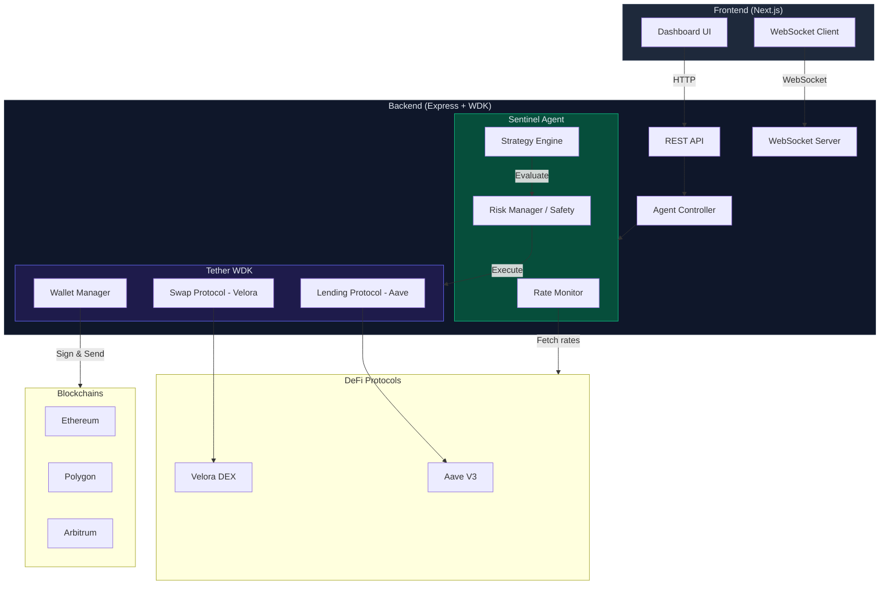

# Architecture

## System Diagram

## Data Flow

1. **Rate Monitor** polls Aave V3 rates every 30 seconds across ETH/Polygon/Arbitrum
2. **Strategy Engine** compares current portfolio positions against best available yields
3. **Risk Manager** validates the proposed action against safety limits
4. **WDK** executes the transaction via self-custodial wallet (sign locally, submit to chain)
5. **WebSocket** pushes real-time updates to the dashboard

## Key Design Decisions

- **Self-custodial**: WDK ensures private keys never leave the host machine
- **Rule-based strategy**: Deterministic decision-making (no LLM dependency for execution) ensures predictable behavior
- **Simulation mode**: Graceful fallback when WDK packages aren't installed, enabling demo without real funds
- **Safety-first**: Multiple layers of protection (per-tx limit, daily cap, concentration check, rate limit, emergency stop)
